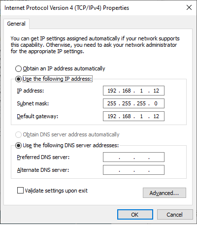

# Building and Running the UDP Bootloader applications

## Downloading and building the application

To clone or download this application from Github,go to the [main page of this repository](https://github.com/Microchip-MPLAB-Harmony/bootloader_apps_ethernet) and then click Clone button to clone this repo or download as zip file. This content can also be download using content manager by following [these instructions](https://github.com/Microchip-MPLAB-Harmony/contentmanager/wiki)

Path of the application within the repository is **apps/udp_bootloader/**

To build the application, refer to the following table and open the project using its IDE.

### Bootloader Application

| Project Name      | Description                                    |
| ----------------- | ---------------------------------------------- |
| bootloader/firmware/sam_v71_xult.X    | MPLABX Project for [SAM V71 Xplained Ultra Evaluation Kit](https://www.microchip.com/DevelopmentTools/ProductDetails/PartNO/ATSAMV71-XULT)|

### Test Application

| Project Name      | Description                                    |
| ----------------- | ---------------------------------------------- |
| test_app/firmware/sam_v71_xult.X    | MPLABX Project for [SAM V71 Xplained Ultra Evaluation Kit](https://www.microchip.com/DevelopmentTools/ProductDetails/PartNO/ATSAMV71-XULT)|

## Setting up [SAM V71 Xplained Ultra Evaluation Kit](https://www.microchip.com/DevelopmentTools/ProductDetails/PartNO/ATSAMV71-XULT)

- Connect the Debug USB port on the board to the computer using a micro USB cable
- Establish a connection between Host PC and the device through the RJ45 Ethernet connector on the PHY daughter board using an Ethernet cable

## Running the Application

1. Open the test application project *test_app/firmware/sam_v71_xult.X* in the IDE
2. Build the project to generate the binary **(Do not program the binary)**
3. Open the bootloader project *bootloader/firmware/sam_v71_xult.X* in the IDE
4. Build and program the application using the IDE

5. **LED0** will be Turned On once programming is completed and bootloader starts running

6. Open the Terminal application (Ex.:Tera Term) on the computer to get test application messages through UART once bootloaded
7. Configure the serial port settings as follows:
    - Baud : 115200
    - Data : 8 Bits
    - Parity : None
    - Stop : 1 Bit
    - Flow Control : None

8. Configure the Host PC for setting up IP Address to communicate with the device
    - Go to **Control Panel\Network and Internet\Network Connections**
    - Open **Ethernet properties**

        

    - Double Click on **Internet Protocol Version 4 (TCP/IPv4)**

        

    - Configure the IP Address as shown below
        - **IP address : 192.168.1.12**
        - **Subnet Mask : 255.255.255.0**

        

9. Launch the Unified Host application from below path
    - *\<harmony3_path\>\bootloader\tools\UnifiedHost-\*\UnifiedHost-\*.jar*

10. Configure the Unified host application
    - Select the **Device architecture** and **Protocol** as shown below

        

    - Click on configure button to configure UDP port Number and IP Address

        

    - Load the test application hex file to be programmed using below option
        - *\<harmony3_path\>\bootloader_apps_ethernet\apps\udp_bootloader\test_app\firmware\sam_v71_xult.X\dist\sam_v71_xult\production\sam_v71_xult.X.production.hex*

        

    - Open the **Console** window of the host application to view application bootloading sequence

        

11. Click on **Program Device** button to program the loaded test application hex file on to the device

    

12. Following snapshot shows output of successfully programming the test application

    

13. If above step is successful then **LED0** should start blinking and you should see below output on the console

    

14. Press and hold the Switch **SW0** to trigger Bootloader from test application and you should see below output

    

15. Repeat Steps 11-13 once and jump to Step-16
    - This step is to verify that bootloader is running after triggering bootloader from test application in Step 14

16. **Press and hold** the Switch **SW0** and then press Reset button or Power cycle the device to force trigger bootloader at startup
17. Repeat Steps 11-13 once
    - This step is to verify whether bootloader is triggered by switch press at reset

## Additional Steps (Optional)
- To bootload any other application refer to [Application Configurations](../../docs/readme_configure_application_sam.md)

- Once done repeat the applicable steps mentioned in [Running The Application](#running-the-application)
