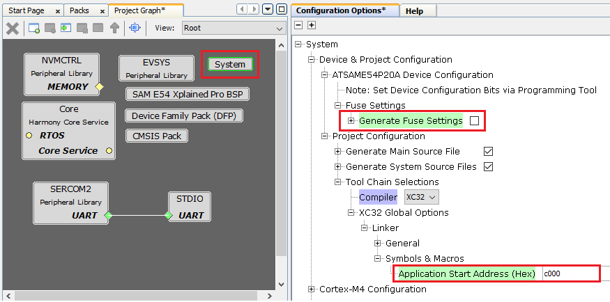
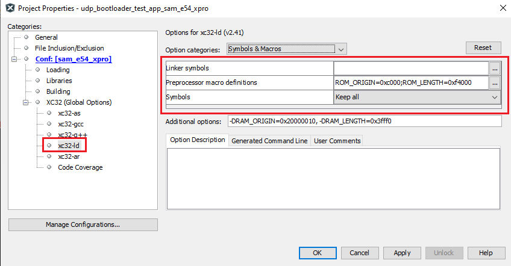
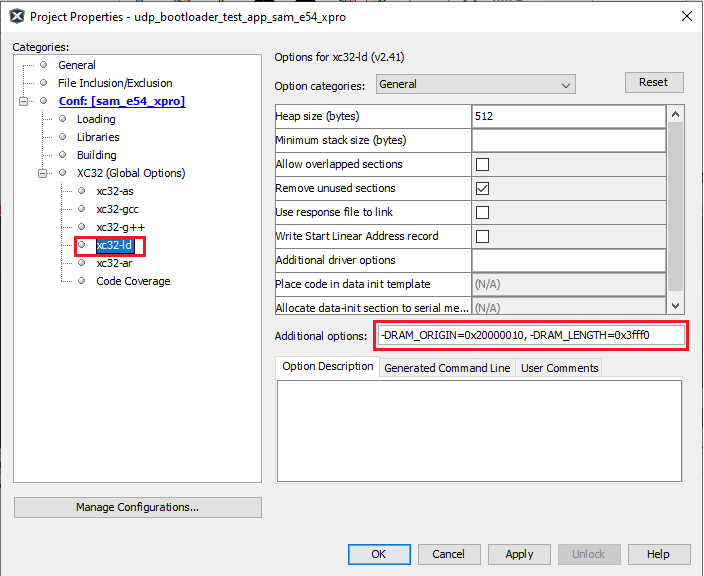

# Configuring an application to be bootloaded for CORTEX-M based MCUs

**Parent topic:**[Configuring an Application to be bootloaded](GUID-3B1FA678-3007-4013-B9D6-9A8D05335EF1.md)

## Application settings in MCC system configuration

1.  Launch MCC for the application project to be configured

2.  Select **system** component from the project graph and configure the below highlighted settings

1.  **Disable Fuse Settings:**

    -   Fuse settings needs to be disabled for the application which will be boot-loaded as the fuse settings are supposed to be programmed through programming tool from bootloader code. Also the fuse settings are not programmable through firmware

    -   Enabling the fuse settings also increases the size of the binary when generated through the hex file

2.  **Specify the Application Start Address:**

    -   Specify the Start address from where the application will run under the **Application Start Address \(Hex\)** option in System block in MCC.

    -   This value should be equal to or greater than the bootloader size and must be aligned to the erase unit size on that device.

    -   As this value will be used by bootloader to Jump to application at device reset it should match the value provided to bootloader code

    -   The **Application Start Address \(Hex\)** will be used to generate XC32 compiler settings to place the code at intended address

    -   After the project is regenerated, the ROM\_ORIGIN and ROM\_LENGTH are the XC32 linker variables which will be overridden with value provided for **Application Start Address \(Hex\)** and can be verified under Options for xc32-ld in Project Properties in MPLABX IDE as shown below.

## MPLAB X Settings

-   Check the **Normalize hex file** option as shown below, as the **Unified bootloader host application** takes hex file as an input. **Normalizing the hex file will make sure the data in the hex file is arranged sequentially**

## Additional settings \(Optional\)

-   **RAM\_ORIGIN** and **RAM\_LENGTH** values should be provided for reserving configured bytes from start of RAM to **trigger bootloader from firmware**

-   Under Project Properties, expand options for xc32-ld and define the values for **RAM\_ORIGIN** and **RAM\_LENGTH** under Additional options

-   This is optional and can be ignored if not required

