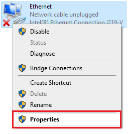
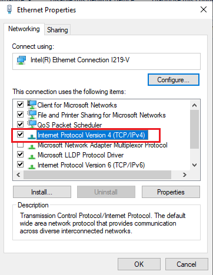

# SAM E54 Xplained Pro Evaluation Kit: Building and Running the UDP Live Update applications

**Parent topic:**[UDP Live Update](GUID-BBB8BC6B-6A47-4A08-9DAF-07301977FA73.md)

## Downloading and building the application

To clone or download this application from Github,go to the [main page of this repository](https://github.com/Microchip-MPLAB-Harmony/bootloader_apps_ethernet) and then click Clone button to clone this repo or download as zip file. This content can also be download using content manager by following [these instructions](https://github.com/Microchip-MPLAB-Harmony/contentmanager/wiki)

Path of the application within the repository is **apps/udp\_live\_update/**

To build the application, refer to the following table and open the project using its IDE.

### Live Update Application

|Project Name|Description|
|------------|-----------|
|live\_update\_app/firmware/sam\_e54\_xpro.X|MPLABX Project for [SAM E54 Xplained Pro Evaluation Kit](https://www.microchip.com/developmenttools/ProductDetails/atsame54-xpro)|

## Setting up [SAM E54 Xplained Pro Evaluation Kit](https://www.microchip.com/developmenttools/ProductDetails/atsame54-xpro)

-   Connect the Debug USB port on the board to the computer using a micro USB cable

-   Establish a connection between Host PC and the device through the RJ45 Ethernet connector using an Ethernet cable

## Running the Application

1.  Open the Terminal application \(Ex.:Tera Term\) on the computer to get live update application messages through UART once loaded

2.  Configure the serial port settings as follows:

    -   Baud : 115200

    -   Data : 8 Bits

    -   Parity : None

    -   Stop : 1 Bit

    -   Flow Control : None

3.  Open the live\_update\_app application project *live\_update\_app/firmware/sam\_e54\_xpro.X* in the IDE

4.  Build and program the **live\_update\_app** application using the IDE

5.  **LED0** should start blinking once programming is completed and below message has to be displayed on the Console

    -   You can see how the live update application was loaded in BANK A by IDE

    

6.  Configure the Host PC for setting up IP Address to communicate with the device

    -   Go to **Control Panel/Network and Internet/Network Connections**

    -   Open **Ethernet properties**

        

    -   Double Click on **Internet Protocol Version 4 \(TCP/IPv4\)**

        

    -   Configure the IP Address as shown below

        -   **IP address : 192.168.1.12**

        -   **Subnet Mask : 255.255.255.0**

        

7.  Launch the Unified Host application from below path

    -   <harmony3\_path\>/bootloader/tools/UnifiedHost-\*/UnifiedHost-\*.jar

8.  Configure the Unified host application

    -   Select the **Device architecture** and **Protocol** as shown below

        

    -   Click on configure button to configure UDP port Number and IP Address

        

    -   Load the live update application hex file to be programmed using below option

        -   *<harmony3\_path\>/bootloader\_apps\_ethernet/apps/udp\_live\_update/live\_update\_app/firmware/sam\_e54\_xpro.X/dist/sam\_e54\_xpro/production/sam\_e54\_xpro.X.production.hex*

        

    -   Open the **Console** window of the host application to view application bootloading sequence

        

9.  Click on **Program Device** button to program the loaded live update application hex file on to the device

    -   You can note that throughout the programming sequence and after programming the **LED0** will be blinking as the application task is running along with bootloader task **\(Live Update Feature\)**

    

10. Following snapshot shows output of successfully programming the test application

    -   Ignore the Device Reset Messages from the host tool. The live update application ignores the reset command received and waits for a switch press to update serial number and reset

    

11. Press the Switch **SW0** to update serial of **Inactive Bank** and trigger reset. You should see below output on success

    -   This step shows that the new firmware programmed in **BANK B** is running which is mapped to lower region by switcher at reset

    

12. Repeat Steps 10-12 for further updates and observe the Banks from which application is running at every update

## Configurations to be Noted

### Live Update Application

-   Enable Live Update Option to configure UDP bootloader in **Live Update Mode**

-   **Normalize hex file:**

    -   Check the Normalize hex file option as shown below, as the Unified bootloader host application takes hex file as an input. Normalizing the hex file will make sure the data in the hex file is arranged sequentially.

