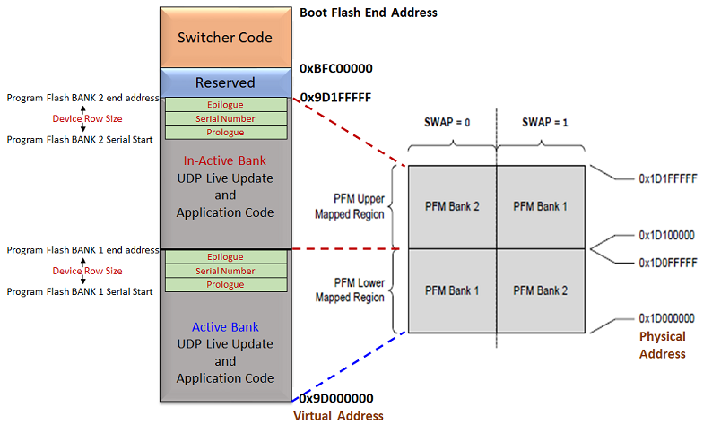

# Live Update Memory layout for MIPS based MCUs

-   Supported for the devices which have a Dual Bank flash memory

-   **Switcher code** is placed at start of the Boot flash memory \(0xBFC00000\) as upon reset the device runs from start of boot flash memory.

    -   **Note: The switcher code provided does not have any programming capabilities. It just performs bank swap operations**

-   Device always executes the application firmware from PFM bank mapped to lower memory region **\(0x1D00\_0000 Physical address\)**

    -   Start address of Active Bank is mapped to lower region **0x9D000000**

    -   Start address of Inactive Bank is from mid of the PFM which can vary from device to device. Refer to respective Data sheets for details of Flash memory layout.

-   Row size number of bytes are reserved at end of each bank for storing serial number. This serial number will be used by the **switcher code placed in BFM** to map the appropriate PFM bank to lower memory region and run the application from there

-   The live update start address should always fall into lower mapped region **\(0x9D000000 to Mid of Flash\)**. Size of the application in the linker script should also not exceed the Mid of flash.

**Parent topic:**[Live Update Memory Layout](GUID-31D74AAF-6F4F-4454-A14B-FDC5CBFBA3C9.md)

